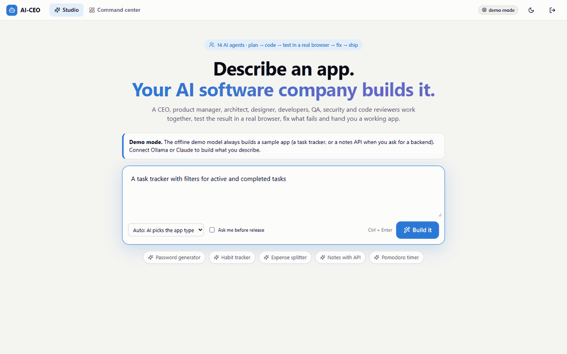
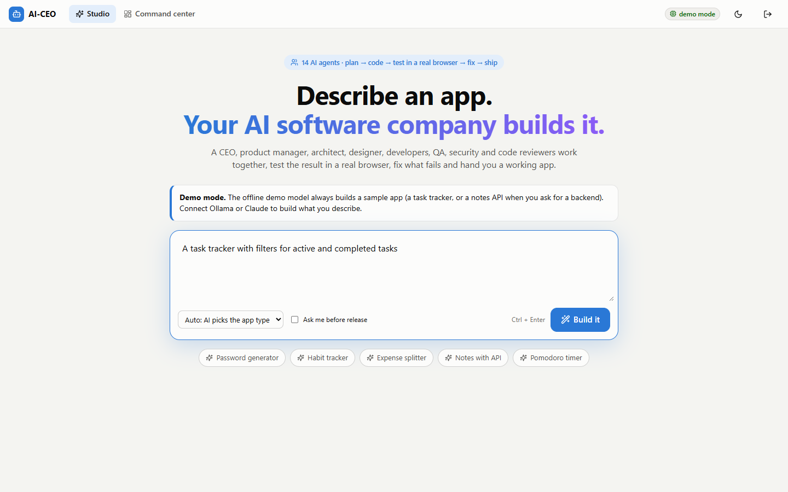
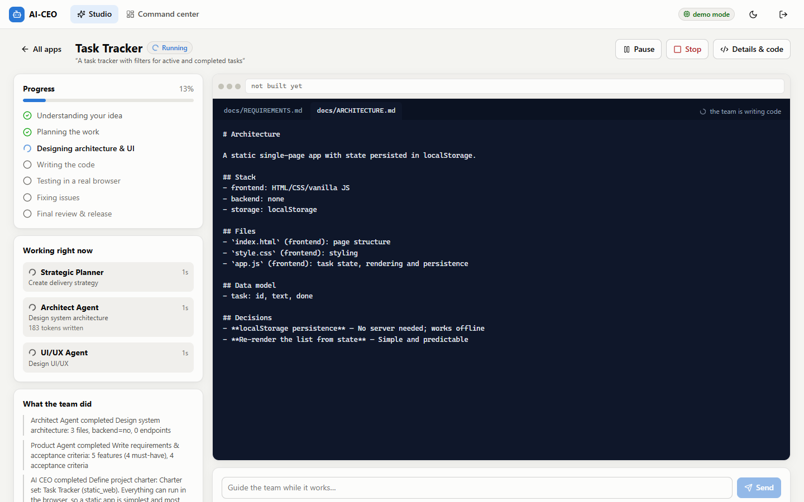
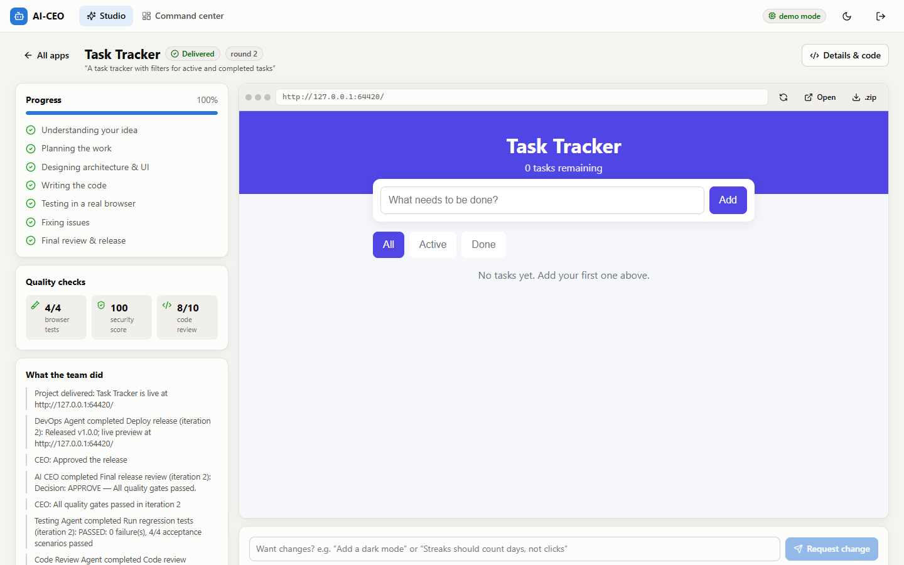
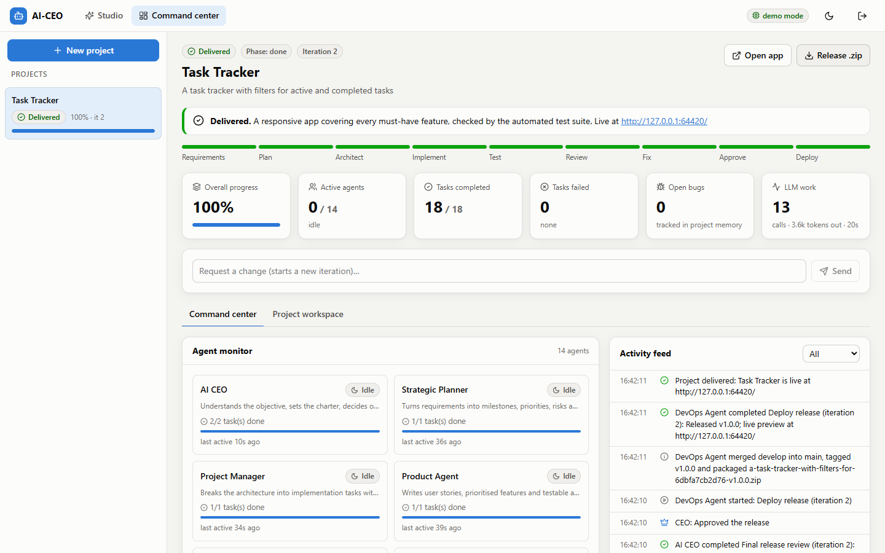
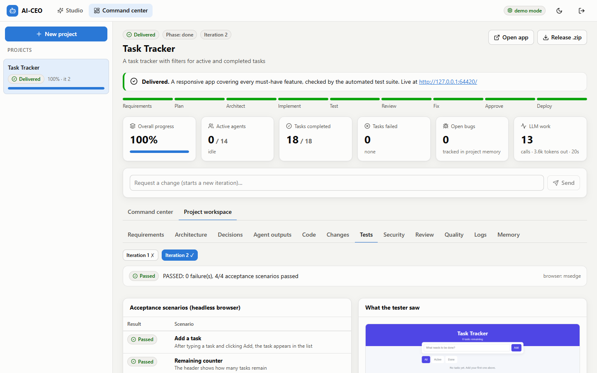
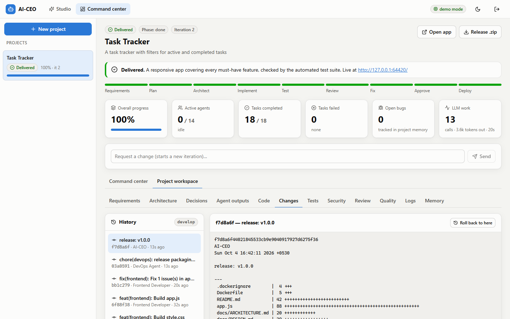
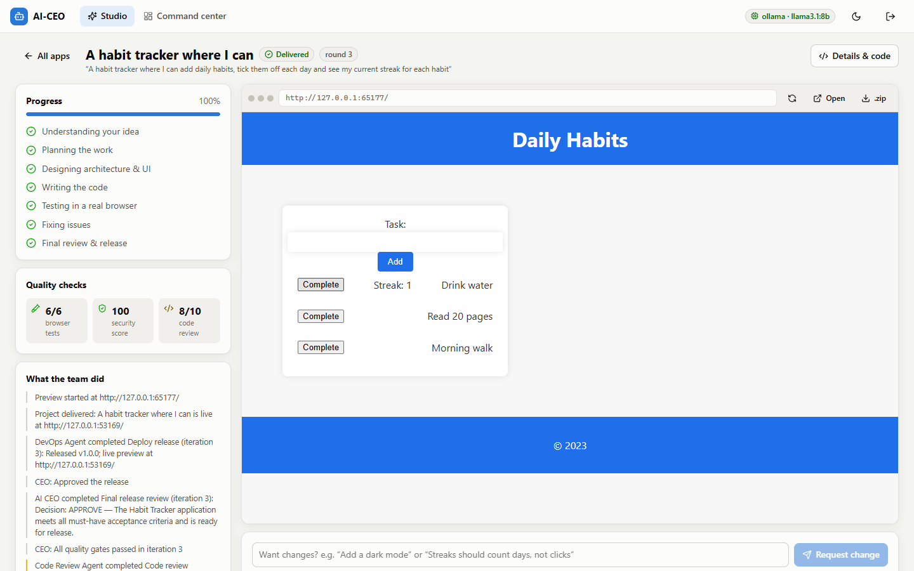

<div align="center">

# AI-CEO

[](https://github.com/irfansheriffhasan-art/ai-ceo/actions/workflows/ci.yml)
[](LICENSE)


### Describe an app. An AI software company builds it.

A CEO, product manager, architect, designer, developers, QA, security and code reviewers —
**14 AI agents** that plan, write the code, **test it in a real browser**, fix what fails and ship a working app.
Runs fully local on your own GPU (Ollama), or with Claude / OpenAI.

Built by **[Irfan Sheriff Hasan](https://www.linkedin.com/in/irfan-sheriff-h-488562429/)**, **Dasthageer Basha J**, **Keerthi Vaasan M** and **Mohamed Thariq**



</div>

## Features

- **Prompt → working app.** Describe the app in plain English. You get a running web app, its git
  history and a downloadable release.
- **A real team, not one prompt.**
  - The CEO sets the scope. The planner, PM and architect break the work down.
  - Developers write one file at a time and self-check each one: syntax, element ids, browser APIs and imports.
- **Verified, not assumed.**
  - The app is opened in headless Edge or Chrome via Playwright and driven through acceptance tests
    written from your requirements.
  - Generated APIs are tested live.
  - A security scanner runs on every round.
- **Self-correcting.**
  - Failures are routed to the developer who owns the file, with exact reproduction steps.
  - The CEO rolls back regressions, and tests that are themselves wrong get disputed and rewritten.
  - When the team can't converge, it asks you.
- **You stay in control.** Pause, resume, stop, approve, reject with feedback, request changes after
  release, roll back to any commit, retry or reassign any task.
- **Watch it work.** The Studio shows progress, the agents working right now, code as it is
  written, quality scores and the finished app running inline. The Command center shows every task,
  decision, test, diff and LLM call.

| Prompt | Live build | Result |
|---|---|---|
|  |  |  |

| Command center | QA with real-browser screenshots | Git history & rollback |
|---|---|---|
|  |  |  |

## Quick start

You need **Python 3.11+**, **Node 18+** and **Git**. For local models, also install [Ollama](https://ollama.com).

**Windows (PowerShell)**
```powershell
git clone https://github.com/irfansheriffhasan-art/ai-ceo.git
cd ai-ceo
powershell -ExecutionPolicy Bypass -File setup.ps1   # one time: venv, packages, web UI, browser, model
powershell -ExecutionPolicy Bypass -File start.ps1   # opens the Studio, already signed in
```

**macOS / Linux**
```bash
git clone https://github.com/irfansheriffhasan-art/ai-ceo.git && cd ai-ceo
chmod +x setup.sh start.sh
./setup.sh
./start.sh
```

**No GPU and no API key?** Start the offline demo:
`start.ps1 -Demo` / `./start.sh --demo`. The demo model builds a sample task tracker so you can
see the whole pipeline. Its first version contains a deliberate bug, and you watch QA catch it and
the team fix it.

**Use Claude for the best results:** copy `.env.example` to `.env` and set
`AICEO_LLM_PROVIDER=anthropic` and `ANTHROPIC_API_KEY=...`.

## Real results on a laptop

Everything above also runs on a local 8B model. The run below used `llama3.1:8b` on an
RTX 4050 laptop GPU (6 GB). Prompt: *"A habit tracker where I can add daily habits, tick them off each
day and see my current streak for each habit"*.



- **Time:** 14 minutes for 3 rounds. Round 1 passed 5/6 browser tests. QA then disputed a stubborn
  test and rewrote it, and round 3 passed 6/6 with security at 100/100.
- **Release:** the CEO approved the release, then DevOps tagged v1.0.0 and started a live preview.
- **Known limitation:** small local models still miss subtleties. Here, the streak counted clicks
  rather than days. You fix that with a change request ("streaks should count days"), which starts a
  new round. Stronger models need fewer rounds.

## How it works

```
You ──▶ CEO (scope) ──▶ Strategic Planner ──▶ Project Manager ──▶ Orchestrator
                                                                     │
   Product · Architect · UI/UX · Frontend · Backend · Database · AI/ML · Security · Testing · Review · DevOps
                                                                     │
      browser tests + API tests + security scan + code review ──▶ CEO decision
           ▲                                                         │
           └──── fix tasks to the file's owner (bounded rounds) ◀────┤
                                                                     ▼
                                          approve ──▶ git merge + tag + zip + live preview
```

The development loop is controlled by deterministic, auditable CEO rules
([`ai_ceo/orchestrator/policy.py`](ai_ceo/orchestrator/policy.py)), so a weak model can't derail it.
Models do the creative work: requirements, design, code, tests and reviews.

**Stack:**
- Python 3.11+, FastAPI, SQLAlchemy/SQLite, Playwright
- React + TypeScript (Vite)
- Ollama, the Anthropic SDK or OpenAI for the models

---

## Command reference

| Command | What it does |
|---|---|
| `python main.py` | Interactive: enter an idea, watch the live agent view, approve the release |
| `python main.py run "<idea>" [--backend] [--approve] [--max-fix N] [--yes]` | Build an idea; `--backend` forces a FastAPI + SQLite app |
| `python main.py resume <project-id> [--feedback "..."] [--more-fixes N] [--approve-release]` | Continue an interrupted, paused, stopped or escalated project from where it left off — optionally steering it with feedback, granting more fix iterations, or approving the release |
| `python main.py serve [--host H] [--port P]` | API + dashboard (default http://localhost:8000) |
| `python main.py list` | List projects |
| `python main.py doctor` | Check LLM, model, git, node and browser |
| Global: `--provider ollama\|anthropic\|openai\|mock`, `--model NAME` | Override the configured LLM |

---

## The development loop

| Phase | Who | What actually happens |
|---|---|---|
| Requirements | CEO, Product | Charter (static vs backend app, constraints); user stories, prioritised features, **testable acceptance criteria** |
| Plan | Strategic Planner, PM | Milestones, risks, definition of done; deterministic work breakdown into a dependency graph |
| Architect | Architect, UI/UX | Stack, file plan with owners, data model, API, decisions; palette, typography, components, accessibility |
| Implement | Frontend / Backend / Database / AI-ML | One file per model call with dependent files in context; **self-check** (syntax via `node --check` / `ast`, element-id cross-references, browser-only APIs, import policy) before hand-off |
| Test | Testing | Static analysis; app served locally and driven by **Playwright** (load, console errors, screenshot); acceptance scenarios generated from the criteria; **API tests against the running backend**; regression tracking |
| Review | Security, Code Review | Rule-based security scan; LLM code review against the requirements |
| Fix | CEO → file owners | Blocking issues are grouped per file and assigned to the file's owner, then the full suite runs again |
| Approve | CEO (+ you) | Gate check plus an LLM release review; optional human approval |
| Deploy | DevOps | README, Dockerfile, run scripts; merge `develop`→`main`, tag, `git archive` zip, live preview |

### Self-correction and failure handling

- **Task failure:** the task is retried (default 3 attempts) with the previous error fed back to the
  agent. After that, the CEO reassigns it to an escalation engineer with a simplified brief. If it
  still fails, the CEO escalates to you, and you can retry, reassign, skip or stop.
- **Quality failure:** correction tasks go to the owner of each failing file, and the whole suite runs
  again. This repeats for up to `max_fix_iterations`.
- **No convergence:** the CEO rolls back to the best-scoring iteration (a new commit, so history is
  kept) and escalates to you. You can approve anyway, grant more iterations or give feedback.
- **Invalid tests:** when a scenario references elements that exist nowhere in the code, it is
  classified as a *test* defect and rewritten. No developer is sent to "fix" working code.
- **Test disputes:** a scenario that fails identically twice, even though developers fixed the code
  in between, is re-validated by QA. Wrong tests then stop burning fix iterations; random output,
  for example, must be checked by length or regex, never against an exact string.
- **Reproduction steps:** every failed acceptance test reaches the developer with exact repro steps
  from a fresh page load, like a real QA ticket.
- **Bounded shared memory:** only the CEO, the platform rules and the client can set constraints. A
  planner's advisory notes can't override them in every developer's prompt.
- **Timeouts** apply to every model call and every task.
- **Restarts:** interrupted tasks are re-queued and the project is parked as paused. Continue it with
  `resume` or the dashboard.
- **Loop protection:** retry limits, iteration budgets, de-duplicated review comments and a
  no-progress detector make sure the loop always terminates.

The loop is driven by deterministic CEO *policy* code (`orchestrator/policy.py`) rather than by a
model. A weak model therefore cannot derail it, and every decision is logged with its reason.

---

## Dashboard (command center)

- **Overview:**
  - status, phase stepper and iteration
  - KPIs: progress, active agents, completed/failed tasks, open bugs, LLM usage
- **Agent monitor:** all 14 agents with role, status, current task, elapsed time, live token count,
  per-project progress and last activity.
- **Task board:** Backlog · Planned · In Progress · Testing · Review · Completed · Failed. Click a task
  for its details, output, model calls and log, plus **Retry / Skip / Reassign**.
- **Activity feed:** real-time stream over SSE, filterable to decisions or problems.
- **Project workspace:**
  - requirements, architecture and design, decision log, agent outputs
  - code browser with search and dependency graph
  - git history with diffs and **roll back to any commit**
  - test runs with the browser screenshot and bug tracker
  - security findings, code review
  - quality-score chart per iteration (with a table view)
  - every LLM prompt and response, raw project memory
- **Controls:** Pause (graceful) · Resume · Stop · Approve · Reject with feedback · Keep fixing ·
  Approve anyway · change requests after delivery · start/stop preview · download the release zip.

Agents show concise decisions, actions, reasons and outputs. No hidden chain-of-thought is collected
or displayed.

---

## Configuration

Copy `.env.example` to `.env`. Every setting can also be set as an environment variable.

| Setting | Default | Notes |
|---|---|---|
| `AICEO_LLM_PROVIDER` | `ollama` | `ollama`, `anthropic`, `openai`, `mock` |
| `AICEO_LLM_MODEL` | `llama3.1:8b` | With `anthropic` and a local model name configured, `claude-opus-5-5` is used |
| `AICEO_LLM_ROLE_MODELS` | `{}` | Per-agent model, e.g. a coder model for developers |
| `ANTHROPIC_API_KEY` / `OPENAI_API_KEY` | — | Read only from env/`.env`; never logged |
| `AICEO_LLM_MAX_CONCURRENCY` | `1` | Raise for cloud providers |
| `AICEO_MAX_PARALLEL_TASKS` | `3` | Independent tasks run concurrently |
| `AICEO_MAX_FIX_ITERATIONS` | `3` | Per release cycle; overridable per project |
| `AICEO_REQUIRE_HUMAN_APPROVAL` | `false` | Also selectable per project |
| `AICEO_BROWSER_CHANNEL` | `auto` | Bundled Chromium → Edge → Chrome; `none` disables browser tests |
| `AICEO_RUN_GENERATED_BACKENDS` | `true` | Generated FastAPI apps are executed for API tests and previews |

Runtime data lives in `data/` (gitignored): `aiceo.db` (SQLite), `workspaces/` (one git repository
per generated project), `releases/`, `artifacts/` (screenshots, logs), `logs/aiceo.jsonl`.

### Model choice and speed

The default local model is `llama3.1:8b`. On a 6 GB laptop GPU it generates about 13–15 tokens/s
with part of the model on the CPU, so one build takes **10–25 minutes and 15–25 model calls**. Small
models make many mistakes, which is why the platform leans on fixed project layouts, file-by-file
generation, self-checks and real tests. With `AICEO_LLM_PROVIDER=anthropic` (Claude) the same
pipeline is much faster per iteration and needs far fewer fix iterations.

---

## Security model

- **Dashboard and API:**
  - one access token (generated on first run, stored in `data/auth_token`), exchanged for an
    HttpOnly, SameSite=Strict session cookie that does not contain the token
  - Bearer tokens for scripts
  - login throttling
  - state-changing requests need the `X-AICEO-Request` header and an allowed Origin (CSRF protection)
  - CSP, `X-Frame-Options: DENY`, `nosniff`, `no-referrer`
  - binds to `127.0.0.1` by default
  - input validation on every endpoint
- **Generated code is untrusted:**
  - model-proposed paths are validated (relative paths only, no traversal, no dotfiles such as
    `.git`/`.env`, an extension allow-list, size limits)
  - preview and test servers refuse dot-paths and listen on localhost only
  - generated backends run in a subprocess whose environment is stripped of keys, tokens and
    passwords, with a throwaway database and timeouts
  - this is process isolation, not a container sandbox. Set `AICEO_RUN_GENERATED_BACKENDS=false` on
    machines where running model-written Python is not acceptable.
- **Security agent:** checks for
  - secrets (with redaction in reports)
  - `eval`/`Function`, XSS sinks
  - insecure randomness for passwords and tokens
  - SQL injection, shell execution, unsafe deserialization
  - unvalidated FastAPI bodies, unauthenticated mutating endpoints
  - permissive CORS, debug mode, unpinned or unvetted dependencies, root containers

  No CVE database is bundled; run `pip-audit` / `npm audit` in CI for that.

---

## Testing the platform

```powershell
python -m pytest            # 64 tests, about 2–3 minutes (uses a real headless browser when available)
cd web; npm run typecheck   # dashboard type check
```

The suite covers:
- parsing (including the exact reply format that broke the prototype)
- path safety, git operations, code analysis
- static checks, the security scanner and browser-harness semantics
- full autonomous cycles: static app, backend app with API tests, injected-bug fix loop
- failure recovery (reassign → escalate → human retry), timeouts, pause/resume/stop, approval and
  rejection, change requests, rollback, restart recovery
- API authentication, CSRF and Origin checks, throttling, validation, data endpoints, and a live
  SSE stream over real HTTP

---

## Project structure

```
main.py                 entry point (CLI)
ai_ceo/
  config.py             typed settings (.env / environment)
  llm/                  providers (ollama, anthropic, openai, mock), client, parsing
  agents/               the 14 agents + shared engineering conventions
  orchestrator/         engine (controls), runner (scheduler), policy (CEO decisions), tracker
  verification/         static checks, browser tests, API tests, security scanner, local servers
  workspace/            sandboxed files, git, code intelligence
  prompts/              editable prompt templates (*.md)
  db.py memory.py events.py services.py deploy.py
  api/                  FastAPI app, auth, routes (REST + SSE)
web/                    React + TypeScript command center (Vite)
tests/                  pytest suite
legacy/prototype_v1/    the original prototype (archived, unused)
generated_sites/        output of the original prototype (kept as-is)
```

## Docker

`Dockerfile` builds the dashboard and runs the platform on the Playwright Python image, which ships
with a browser. It expects Ollama on the host (`host.docker.internal:11434`):

```bash
docker build -t ai-ceo .
docker run -p 8000:8000 -v ai-ceo-data:/data ai-ceo
```

Docker was not available on the development machine, so this image has not been built or tested yet.

## Known limitations

- Generated apps follow fixed layouts (a static 3-file app, or FastAPI + SQLite with a vanilla
  frontend). This trades flexibility for reliability on small models.
- An 8B local model can still miss requirements or write weak tests. The loop catches most of these,
  but expect escalations; the decision is then yours.
- Single-operator authentication; there are no user accounts or roles.
- The orchestrator runs in-process. Running several projects concurrently is supported, but they share
  one GPU.

## Team

| Name | Links |
|---|---|
| **Irfan Sheriff Hasan** | [LinkedIn](https://www.linkedin.com/in/irfan-sheriff-h-488562429/) · [GitHub](https://github.com/irfansheriffhasan-art) |
| **Dasthageer Basha J** | |
| **Keerthi Vaasan M** | |
| **Mohamed Thariq** | |

If this project is useful or interesting to you, a ⭐ on GitHub helps others find it.

## License

[MIT](LICENSE)
